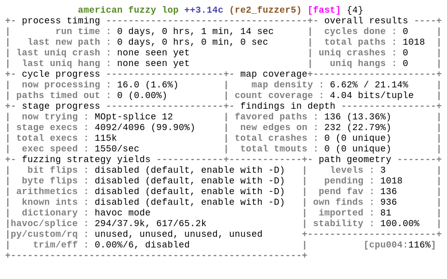
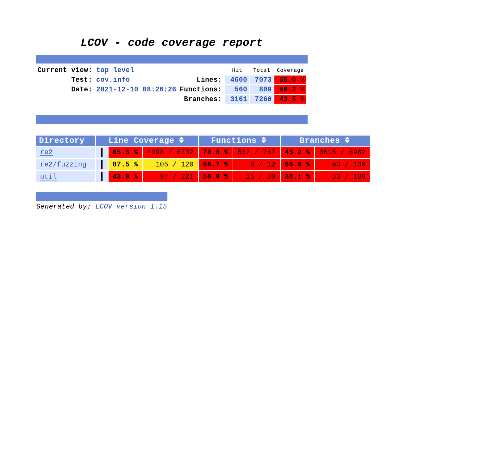

# Фаззинг-тестирование модуля RE2 Library
Фаззинг-тестирование модуля RE2 Library, написанного на языке программирования C++, было выполнено с использованием фаззера с обратной связью по покрытию AFL++ в среде Arch Linux Rolling в режиме статической инструментации кода. Использованы санитайзеры ASAN, UBSAN. Для сбора информации о покрытии исходного кода использованы инструменты lcov, genhtml. Использована коллекция сэмплов, составленная на основе данных из юнит-тестов, а также данных, поступающих в модуль при нормальной работе.<br>
Тестирование модуля выполняется Разработчиком на регулярной основе. Результаты проведения фаззинг-тестирования помещены в электронные приложения (каталог «Электронные приложения/ДАО.2/RE2 Library») и проанализированы на предмет выявления кодовых и архитектурных уязвимостей.<br>
Модуль реализован библиотекой с открытым исходным кодом re2 и используется в продукте RE2 версии 2021-11-01 для разбора данных в сложном структурированном формате RegExp.<br>

# Сборка приложения
При сборке приложения компиляторами фаззера AFL++ тестируемая функция TestOneInput в файле re2_fuzzer.cc помещается в цикл __AFL_LOOP, также в этой функции изменяется способ получения данных на чтение из файла. При этом собранное приложение re2_fuzzer поддерживает запуск в режиме фаззинг-тестирования и может быть запущено следующим образом:
```
./re2_fuzzer @@
```
где "@@" - обозначение для фаззера, что приложение принимает аргументом путь к файлу.<br>
Сборка выполняется следующими командами:
```
env CFLAGS="-g -fno-omit-frame-pointer" CXXFLAGS="-g -fno-omit-frame-pointer" CC=afl-clang-lto CXX=afl-clang-lto++ LD=afl-clang-lto ./fuzz_build.sh
env CFLAGS="-g -fno-omit-frame-pointer" CXXFLAGS="-g -fno-omit-frame-pointer" AFL_LLVM_LAF=1 CC=afl-clang-lto CXX=afl-clang-lto++ LD=afl-clang-lto ./fuzz_build.sh
env CFLAGS="-g -fno-omit-frame-pointer" CXXFLAGS="-g -fno-omit-frame-pointer" AFL_USE_CMPLOG=1 CC=afl-clang-lto CXX=afl-clang-lto++ LD=afl-clang-lto ./fuzz_build.sh
env CFLAGS="-g -fno-omit-frame-pointer" CXXFLAGS="-g -fno-omit-frame-pointer" AFL_USE_ASAN=1 CC=afl-clang-lto CXX=afl-clang-lto++ LD=afl-clang-lto ./fuzz_build.sh
env CFLAGS="-g -fno-omit-frame-pointer" CXXFLAGS="-g -fno-omit-frame-pointer" AFL_USE_UBSAN=1 CC=afl-clang-lto CXX=afl-clang-lto++ LD=afl-clang-lto ./fuzz_build.sh
env CFLAGS="-g -fno-omit-frame-pointer -O0 --coverage" CXXFLAGS="-g -fno-omit-frame-pointer -O0 --coverage" LDFLAGS="--coverage -lgcov" CC=afl-clang-lto CXX=afl-clang-lto++ LD=afl-clang-lto ./fuzz_build.sh
```
<br>Команды запуска фаззера:
```
watch -t -n 5 afl-whatsup -s /fuzz/out
afl-fuzz -i /fuzz/in -o /fuzz/out -m none -D -M re2_fuzzer1 -- /fuzz/basic/re2_fuzzer @@
afl-fuzz -i /fuzz/in -o /fuzz/out -m none -S re2_fuzzer2 -c /fuzz/cmplog/re2_fuzzer -l 2 -- /fuzz/basic/re2_fuzzer @@
afl-fuzz -i /fuzz/in -o /fuzz/out -m none -S re2_fuzzer3 -c /fuzz/cmplog/re2_fuzzer -l 2 -L 0 -- /fuzz/laf/re2_fuzzer @@
afl-fuzz -i /fuzz/in -o /fuzz/out -m none -S re2_fuzzer4 -l 3 -L 0 -Z -- /fuzz/asan/re2_fuzzer @@
afl-fuzz -i /fuzz/in -o /fuzz/out -m none -S re2_fuzzer5 -L 0 -Z -- /fuzz/ubsan/re2_fuzzer @@
```
<br>Условием завершения тестирования является достижение продолжительности тестирования 1 мин.<br>


# Скриншоты работы фаззера
<br>
<br>
<br>
<br>


# Результаты
В процессе фаззинг-тестирования на 5 ядрах процессора было достигнуто условие остановки: продолжительность фаззинг-тестирования составила 1 минуту 10 секунд.<br>
Всего запусков приложения: 693.4 тыс.<br>
В результате работы фаззера падений обнаружено не было.<br>
Зависаний обнаружено не было.<br>

После завершения тестирования было собрано покрытие исходного кода, полученное при запуске тестируемого приложения с каждым из обнаруженных фаззером тестовых примеров.<br>
Покрытие исходного кода по функциям составило 69.22%, по строкам – 65.04%, по базовым блокам – 43.54%.<br>
<br>
